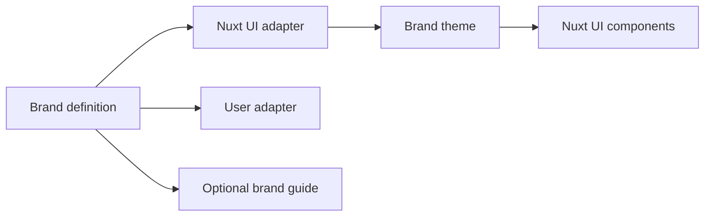

`id` separates the identity contract from concrete brand expression.

## Core objects

| Object | Purpose |
| --- | --- |
| Brand definition | Tool-independent source for named colors, optional free roles, open typography roles, and structured runtime assets. |
| Adapter | Explicit mapping from a brand definition to one target system. `id` maintains the Nuxt UI adapter; users can define their own. |
| Brand guide | Optional documentation and authoring data such as rationale, voice, examples, and component coverage. |
| Brand theme | Runtime-safe adapter output used by the existing Nuxt integration. |
| Brand layer | Nuxt layer that applies a concrete brand at build time. |
| Themed app | Nuxt app that consumes `@happydesigns/id` directly without a separate brand-layer package. Useful for prototypes and small internal apps. |

## Token flow

Brand colors keep their real names. Optional brand roles are free-form aliases, not a universal semantic vocabulary. Typography similarly suggests `sans`, `mono`, and `display` while allowing brand-specific roles. Structured `BrandAssets` may live on the definition without bringing guide prose into runtime code.

The Nuxt UI adapter maps named colors or role values to target roles such as `primary`, `success`, and `neutral`. Its role type deliberately keeps accepting additional strings, so current literals remain useful editor suggestions without preventing future Nuxt UI roles.

Mappings are partial. Omitted Nuxt UI roles keep Nuxt UI defaults. Nuxt UI also keeps its normal color-mode behavior; `dark` CSS variables are only additional overrides when a brand supplies them.

## Why this matters

The same product can receive different identity expression when product components stay brand-neutral. Components ask for role-based values. Brand layers provide those values at build time; optional runtime themes can switch already shipped values.
